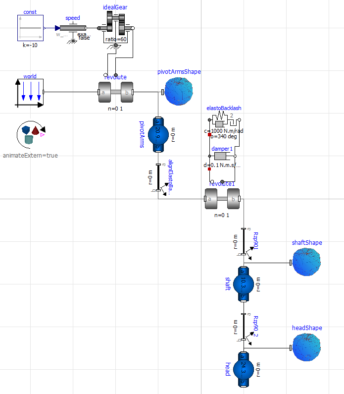
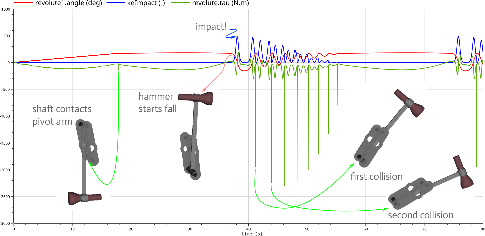

# Modeling Fireball Tool's Vise Hammer
These files were used in [January's MonthlyMechanism](https://mechanomy.com/posts/230116_viseHammer).
I wrote this model in [OpenModelica](https://openmodelica.org/) using the [DLR Visualization Library](https://www.systemcontrolinnovationlab.de/the-dlr-visualization-library/).

